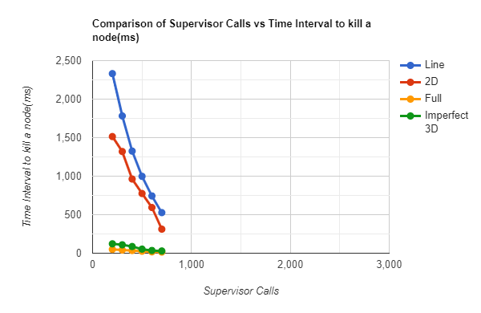

# BONUS TASK

***Question*** 

In the above assignment, there is no failure at all. For a 30% bonus, implement node and failure models (a node dies,  a connection dies temporarily or permanently). Write a Report-bonus.pdf to explain your findings (how you tested, what experiments you performed, what you observed) and submit project2-bonus.tgz/zip with your code. To get the bonus you must implement at least one failure model controlled by a parameter and draw plots that involve the parameter. At least one interesting observation has to be made based on these plots.

***Answer***

We have already implemented a system in our original project where if a nodes'
neighbors have stopped propagating messages by fulfilling the terminating condition, 
i.e, exhausting their 10 calls, and if the topology hasn't converged yet, i.e, 
there are still nodes which are yet to receive the message, then we are modifying the topology by
sending the message to a random that is still alive which are not the neighbors of the deadlocked node.
We are doing this with the help of a supervisor.

But as this question is asked explicitly and has some exclusive tasks to be implemented, we are also fulfilling this task exclusively.

To introduce failures in the topology, a supervisor is being used to kill off random nodes,
the number of nodes to be killed off is given as a parameter.

The performance metric here is the time interval when a node is killed off on the X-axis and the number of calls done ny the supervisor in the Y-axis. 

