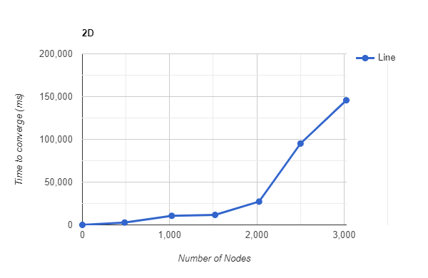
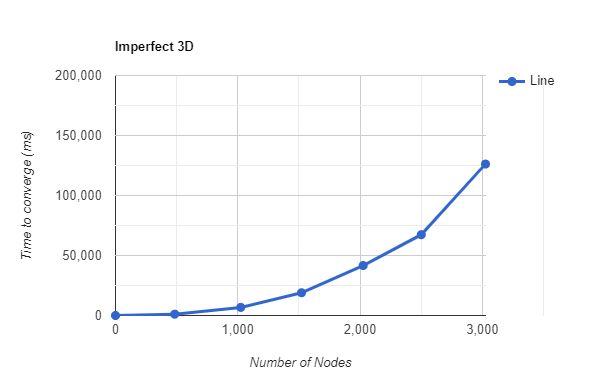

# Gossip and Push Sum Simulator
DOSP Project 2.

Group members -

1) Mayur Reddy Junnuthula (UFID - 36921238)
2) Akhil Srivatsa (UFID - 80826297)

**Project Description**

Gossip Algorithm - https://en.wikipedia.org/wiki/Gossip_protocol

Push Sum Algorithm - https://www.cs.cornell.edu/johannes/papers/2003/focs2003-gossip.pdf

**Steps to Run the Project**
1)  Build the project and run it using the erlang console run configuration in IntelliJ IDEA with just default (zero) arguments and default settings.
2) Start the application with the command main:start() in the erlang console, and follow the input prompts.
3) Enter the number of actors to be spawned by the algorithm.
4) Enter the type of topology (Full Network/Line/2D/Imperfect 3D) in string format.
5) Enter the type of algorithm (Gossip Algorithm/Push Sum Algorithm) in string format.
6) This will start the execution of the selected algorithm and the user will be notified in the terminal of the time it took to reach convergence for the given parameters.

**Implementation**

In our implementation of the gossip algorithm, a node terminates after hearing a rumor 10 times when
it stops passing the rumor to a random neighbor. The convergence of the gossip implementation is measured when 
all the nodes in the network have terminated. For 2D grid and Imperfect 2D grid topologies, the number of nodes to be given as the input should be the nearest
perfect square.

In our implementation of Push-Sum algorithm, every node is initialized with the values suggested in the 
project handout of s = i and w = 1. Similar to our gossip implementation, the number of nodes is rounded to the nearest perfect square for 2D grid and Imperfect 2D grid topologies. The main process asks a random node to start which then passes a message consisting of a tuple of (s/2, w/2) to a rrandom neighbor while keeping values of s/2 and w/2 as its state. When an actor receives a message tuple, it adds the tuple to its state and keeps half its value while passing on another half to a random node. This process continues until an actor’s s/w ratio does not change more than 1.0e-10 for three consecutive iterations after which the actor terminates i.e. it stops passing
a tuple to a random neighbor and the algorithm converges when the sum estimates i.e. s/w converges to the average of the sum.

**Performance Metrics (Convergence Time vs Number of actors/nodes)**

**Gossip Algorithm**

